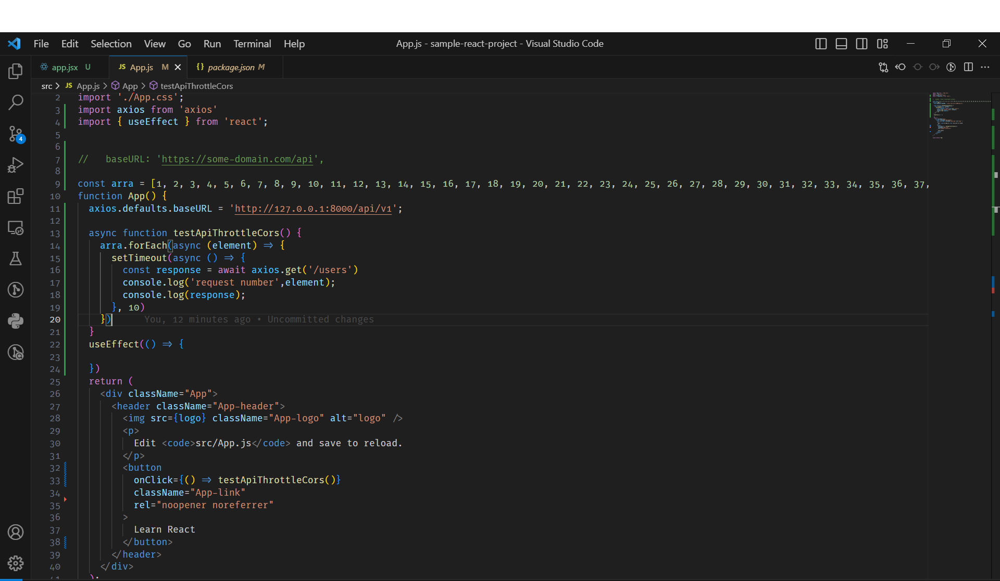

Please Read This
Postman (Documentation): https://documenter.getpostman.com/view/22741474/2s93si2Asg#5ffba680-e62b-41b3-8efd-7b1049d3e94f

<ul>
<li>
Created 4 APIs, to list, create, update & delete the user
</li>
<li>
Route for list is unprotected while other routes are protected
</li>
<li>
Cors are Enabled
</li>
<li>
Rate limiting is implemented to 20 requests/minute
</li>
<li>
Tested APIs Postman
</li>
<li>
Json zip folder along with Environment
</li>
<li>
Zip folder of APIs is attached in the email
</li>
<li>
Implemented and tested authentication
</li>
<li>
Tested 
</li>
</ul>

A user with the name is already created with credentials:

email: admin@gmail.com
password: password

## Installation

Run command `composer install`

then `php artisan migrate:fresh --seed`

Copy env.example as env `cp .env.example .env`

Generate a key for the project `php artisan key:generate`

then `php artisan passport:install`

Put the obtained values with the respective key given below

<code>
PASSPORT_PERSONAL_ACCESS_CLIENT_ID=${clientID}
PASSPORT_PERSONAL_ACCESS_CLIENT_SECRET=${clientSecretKey}
</code>

Hope the project is fine, Thanks for the opportunity!
